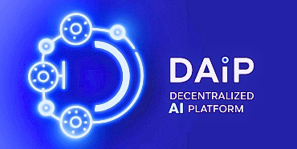

<div align="center">
  
  <h1>Decentralized AI Simulator</h1>
  <p>
    We are developing a scalable framework-agnostic decentralized AI platform for research community.
  </p>  
<!-- Badges -->
<p>
  <a href="https://github.com/mhrehman17/decentai/graphs/contributors">
    
  </a>
  <a href="">
    
  </a>
  <a href="https://github.com/mhrehman17/decentai/network/members">
    
  </a>
  <a href="https://github.com/mhrehman17/decentai/stargazers">
    
  </a>
  <a href="https://github.com/mhrehman17/decentai/issues/">
    
  </a>
  <a href="https://github.com/mhrehman17/decentai/blob/master/LICENSE">
    
  </a>
</p>
   
<h4>
    <a href="https://github.com/mhrehman17/decentai/">View Demo</a>
  <span> · </span>
    <a href="https://github.com/mhrehman17/decentai">Documentation</a>
  <span> · </span>
    <a href="https://github.com/mhrehman17/decentai/">Report Bug</a>
  <span> · </span>
    <a href="https://github.com/mhrehman17/decentai/issues/">Request Feature</a>
  </h4>
</div>

<br />

<!-- Table of Contents -->
# :notebook_with_decorative_cover: Table of Contents

- [About the Project](#star2-about-the-project)
  * [Screenshots](#camera-screenshots)
  * [Tech Stack](#space_invader-tech-stack)
  * [Features](#dart-features)
  * [Color Reference](#art-color-reference)
  * [Environment Variables](#key-environment-variables)
- [Getting Started](#toolbox-getting-started)
  * [Run Locally](#running-run-locally)
- [Roadmap](#compass-roadmap)
- [Contributing](#wave-contributing)
  * [Code of Conduct](#scroll-code-of-conduct)
- [FAQ](#grey_question-faq)
- [License](#warning-license)
- [Contact](#handshake-contact)
- [Acknowledgements](#gem-acknowledgements)

  

<!-- About the Project -->
## :star2: About the Project


<!-- Screenshots -->
### :camera: Screenshots

<div align="center"> 
  
</div>


<!-- TechStack -->
### :space_invader: Tech Stack

- Ubuntu
- Conda
- Python 10+
- Pytorch
- Torch Vision

<!-- Features -->
### :dart: Features (planned)

- 🤔 Framework-agnostic --> 
Bring any kind of ML/DL/AI framework from Pytorch and TensorFlow to Keras and Vanilla ML libraries.

- 🤔 Decentralized --> 
No single point of failure in the entire system. All agents can communicate without centralized control. 

- 🤔 Scalable --> 
The platform supports every kind of data source and every kind of compute device/system

- 🤔 Secure --> 
The system is designed with security-first approach

- 🤔 Privacy-preserving --> 
The privacy of each data producer and data subject is preserved across the system

- 🤔 Device-Native --> 
The control and preferences lies at the device-end

- 🤔 Distributed --> 
The platform complies with all functional and non-functional requirements of a distributed system

<!-- Color Reference -->
### :art: Color Reference

| Color             | Hex                                                                |
| ----------------- | ------------------------------------------------------------------ |
| Primary Color |  #222831 |
| Secondary Color |  #393E46 |
| Accent Color |  #00ADB5 |
| Text Color |  #EEEEEE |


<!-- Env Variables -->
### :key: Environment

To run this project, you will need to create a virtual environment and install
- Python 3.10+
- torch
- torch vision


<!-- Getting Started -->
## 	:toolbox: Getting Started

<!-- Run Locally -->
### :running: Run Locally

Clone the project

```bash
  git clone https://github.com/mhrehman17/decentai.git
```

Go to the download location, and run following command.

```bash
  python -m decentai.main 
```

Now you can see an MNIST example running on screen.

<!-- Roadmap -->
## :compass: Roadmap

* [x] Local multi-agent simulator. You can configure as many training and evaluation agents as you like to.
* [x] MNIST example 
* [x] CIFAR 10 example  
* [x] Multiple aggregators
* [x] Directory structure and stub files for data pipelines
* [x] Directory structure and stub files for differential privacy 
* [ ] Differential privacy engine (opacus, etc.) 
* [ ] SMPC 
* [x] Directory structure and stub files for homomorphic encryption 


<!-- Contributing -->
## :wave: Contributing

<a href="https://github.com/mhrehman17/decentai/graphs/contributors">
  
</a>


Contributions are always welcome! Please feel free to submit pull request, if you want to propose new features, or submit an issue. 

See `contributing.md` for ways to get started.


<!-- Code of Conduct -->
### :scroll: Code of Conduct

Please read the [Code of Conduct](https://github.com/mhrehman17/decentai/blob/master/CODE_OF_CONDUCT.md)

<!-- FAQ -->
## :grey_question: FAQ (coming soon)

- Question 1

  + Answer 1

- Question 2

  + Answer 2


<!-- License -->
## :warning: License

Distributed under the no License. See LICENSE.txt for more information.


<!-- Contact -->
## :handshake: Contact

Habib Rehman - [@habibcomsats](https://twitter.com/habibcomsats) - mhrehman@ieee.org

Project Link: [https://github.com/mhrehman17/decentai](https://github.com/mhrehman17/decentai)


<!-- Acknowledgments -->
## :gem: Acknowledgements

The project is a collective effort of researchers from LEADS and its collaborators.


